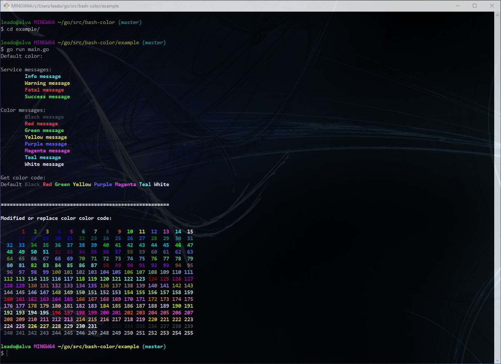

## Installation
#### Use go get.
```bash
go get github.com/evgeny-klyopov/bashColor
```

Then import the bash color package into your own code.
```go
import "github.com/evgeny-klyopov/bashColor"
```

## Example
```go
color := bashColor.NewColor()
color.Print(color.Red, "\tRed message")
```

